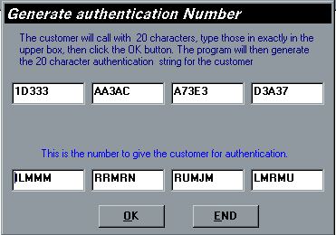



## Authenticate

### Description

Authenticate(project1.vbp) and Authenticate Generator(AuthenticateGenerator.vbp)

separate projects.

I have seen many types of encryption protection, password protection programs to

defeat the end users attempts at getting your software for free. One major problem with this

type of protection is that users can copy and distribute to whomever they please. I created

this program to overcome this problem. Authenticate requires to end user to call for an

authentication number. (Note: This could be accomplished on the internet also if you have an

internet site.) Once the user calls they give you a 20 character string which you type into

the authentication generator, which in turn gives you a 20 character authentication string

to provide the user. The user then enters that authentication number and he is registered.

This number will only be valid for that particular computer. How does the program do this

you ask? First the program reads the Serial Number from the hard drive. When a hard drive is

formatted the operating system saves a random 32 bit number onto the disk as a serial

number. This makes the serial number unique, or unique enough to prevent the software

which you worked so hard to create from being distributed illegally. The program

encrypts this serial number with 5 sophisticated algorithms.

Any questions will be answered promptly. Don't forget to rate this program. All feedback welcome.

Enjoy--
 
### More Info
 

             |
---                |---
**Submitted On**   |2000-11-26 08:49:22
**By**             |[Mark Duhaime](https://github.com/Planet-Source-Code/PSCIndex/blob/master/ByAuthor/mark-duhaime.md)
**Level**          |Advanced
**User Rating**    |4.3 (250 globes from 58 users)
**Compatibility**  |VB 5\.0, VB 6\.0
**Category**       |[Encryption](https://github.com/Planet-Source-Code/PSCIndex/blob/master/ByCategory/encryption__1-48.md)
**World**          |[Visual Basic](https://github.com/Planet-Source-Code/PSCIndex/blob/master/ByWorld/visual-basic.md)
**Archive File**   |[CODE\_UPLOAD122231212000\.zip](https://github.com/Planet-Source-Code/mark-duhaime-authenticate__1-13235/archive/master.zip)

### API Declarations

Declared in files.

